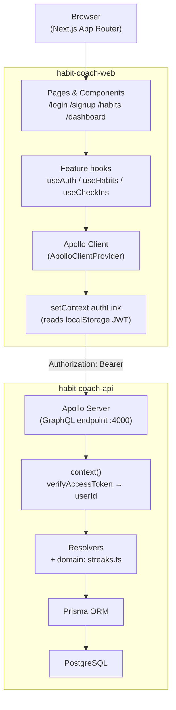
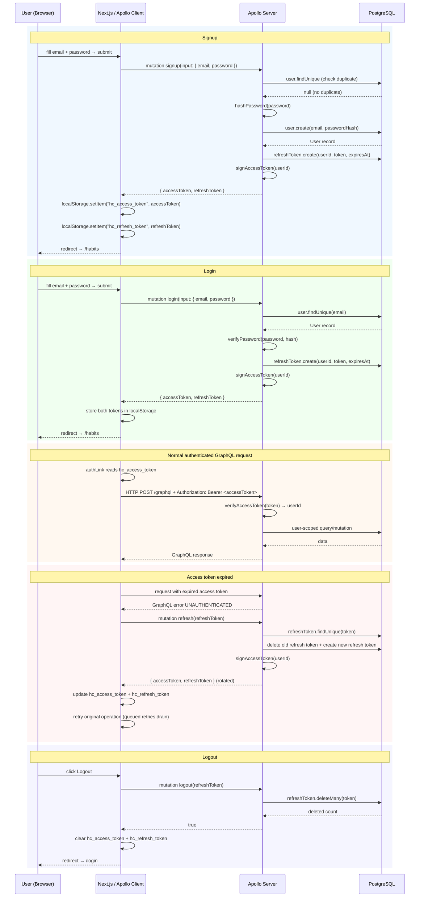
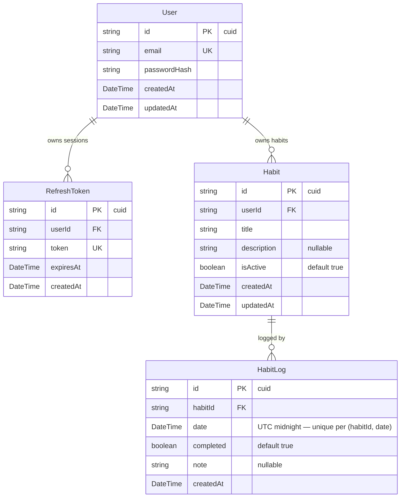
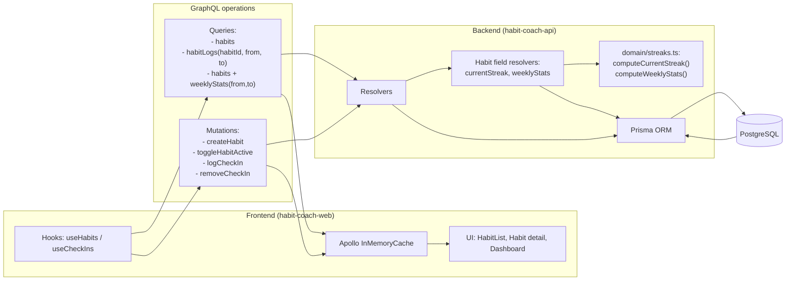
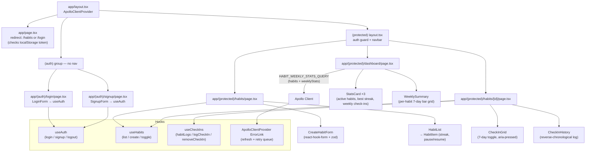

# Habit Coach — Architecture & Flows

Living reference for how the two repos fit together. All diagrams reflect the **current MVP + token refresh/logout state** and should be updated as new phases land.

---

## 1. System overview

---

## 2. Auth flow

---

## 3. Data model (entity relationships)

**Key constraints**

- `User.email` — unique
- `RefreshToken.token` — unique
- `(HabitLog.habitId, HabitLog.date)` — unique (one log per habit per UTC calendar day)
- Cascade deletes:
  - deleting `User` deletes `RefreshToken` rows and `Habit` rows
  - deleting `Habit` deletes `HabitLog` rows

---

## 4. Habits & check-ins data flow

**Flow notes**

- `useHabits` drives list/create/toggle and reads from `HABITS_QUERY`.
- `useCheckIns` drives 7-day check-in toggles with `HABIT_LOGS_QUERY` + check-in mutations.
- Dashboard reads habits with `weeklyStats(from,to)` and computes UI aggregates (active habits, best current streak, weekly check-ins).
- Streak/business logic lives in backend domain functions, not in frontend math.
- Dates are treated as UTC calendar dates (`YYYY-MM-DD`) end-to-end.

---

## 5. Frontend component & page structure

---

## Known gaps (to close in future sprints)

| Gap                                   | Phase             | Notes                                                                                                                            |
| ------------------------------------- | ----------------- | -------------------------------------------------------------------------------------------------------------------------------- |
| `longestStreak` not in schema         | Phase 3 follow-up | Dashboard currently shows **best current streak** across habits, not all-time longest streak                                     |
| Server-side auth guard                | Phase 4           | Auth is primarily client-driven; add edge/server route protection (e.g. middleware/session strategy) for stronger SSR protection |
| Reminder scheduling / background jobs | v1.5              | Optional reminder flow not implemented yet                                                                                       |
| Dashboard/cache optimization          | v1.5              | Current approach is refetch-first in places; can be optimized with targeted cache updates and/or server caching                  |
