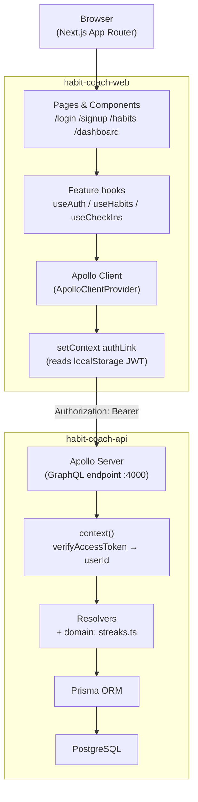
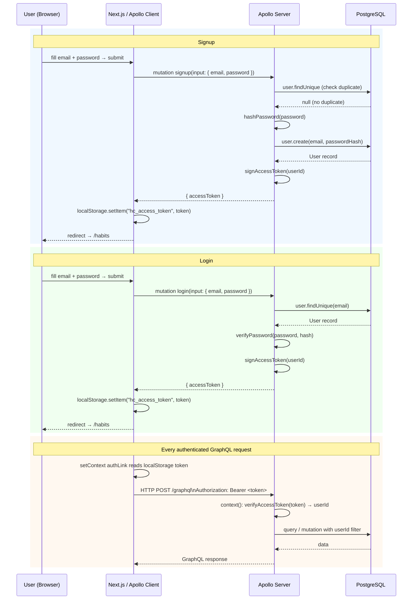
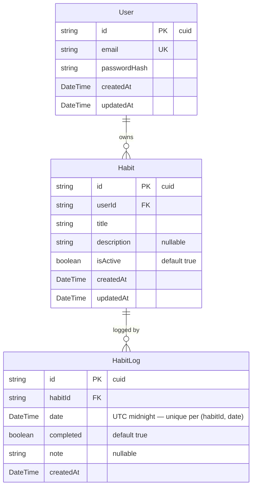
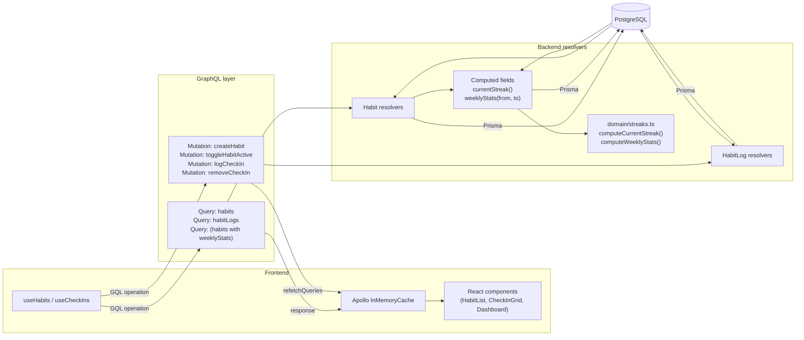
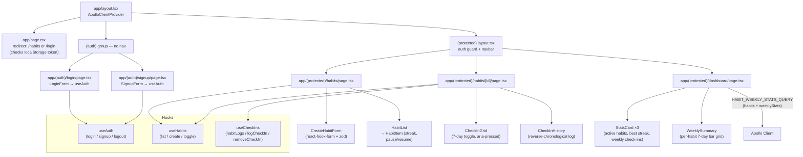

# Habit Coach — Architecture & Flows

Living reference for how the two repos fit together. All diagrams reflect the **Sprint 1** state of the codebase and will be updated as new phases land.

---

## 1. System overview

---

## 2. Auth flow

---

## 3. Data model (entity relationships)

**Key constraints**
- `User.email` — unique
- `(HabitLog.habitId, HabitLog.date)` — unique (one log per habit per UTC calendar day)
- Cascade deletes: removing a User deletes their Habits; removing a Habit deletes its HabitLogs

---

## 4. Habits & check-ins data flow

**Cache strategy (Sprint 1):** mutations use `refetchQueries` to re-fetch affected lists. Apollo `cache-and-network` fetch policy keeps the UI snappy on revisit while ensuring freshness.

---

## 5. Frontend component & page structure

---

## Known gaps (to close in future sprints)

| Gap | Phase | Notes |
|-----|-------|-------|
| `longestStreak` not in schema | Phase 3 | Dashboard shows "best current streak" derived across habits at query time |
| Refresh token / silent refresh | Phase 4 | Only access token stored in localStorage today |
| Server-side auth guard | Phase 4 | Auth check is client-side only (localStorage); SSR pages are not protected at the edge |
| GraphQL Code Generator | Sprint 2 | Operations and types are hand-written; codegen will enforce contract alignment automatically |
